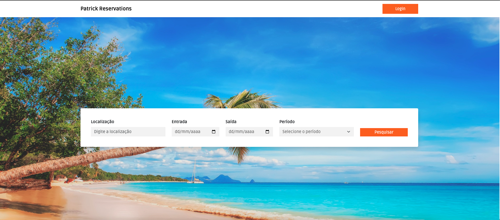
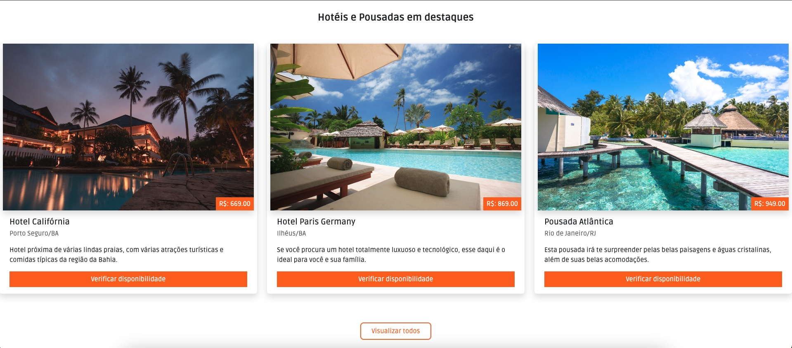
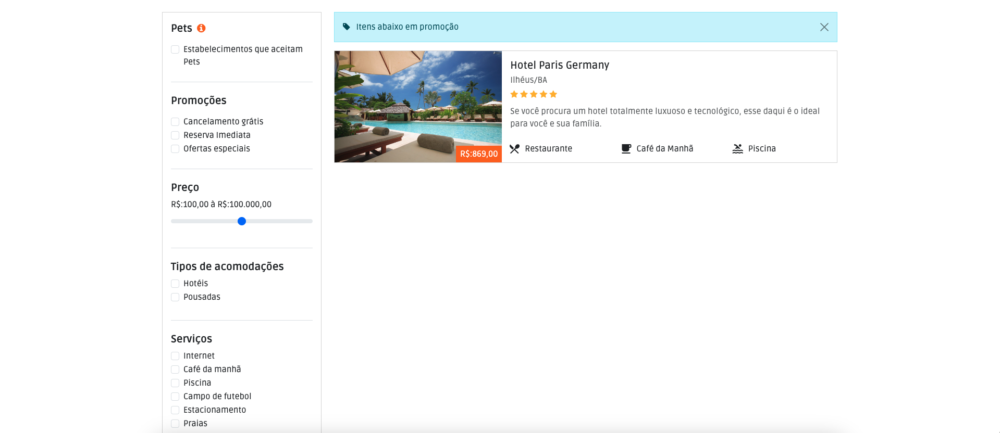
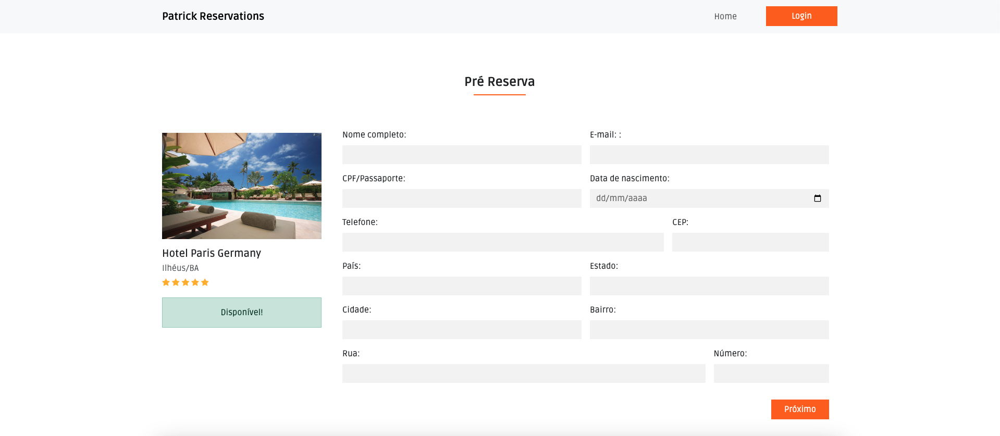
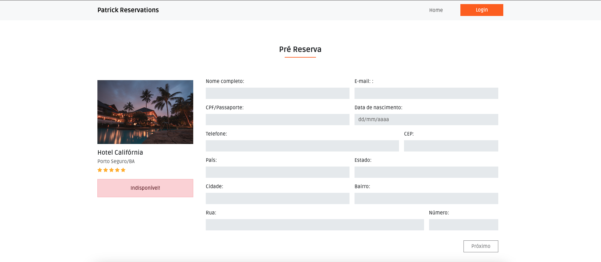

# Site de reserva de Hotéis e Pousadas

## Sobre o Projeto

O projeto ainda não possui o backend, somente as telas do site e opções estáticas.
Seu objetivo é após o backend ser adicionado, ficar o mais próximo possível dos sites de reserva de hotéis e pousadas que acessamos hoje.
O backend será feito em **Node.js** e o Banco de Dados será o **PostgreSQL**.

## Layout do Projeto

Tela Inicial

Tela dos Hotéis e Pousadas em destques

Tela dos diferenciais

Tela de avaliações e footer

Tela de resultado de pesquisa

Tela de Hotel disponível

Tela de Hotel indisponível

Tela de Login

## Tecnologias utilizadas

- HTML5
- CSS3
- Bootstrap
- Node.js
- PostgreSQL

## Autor

**Patrick Cuppi**